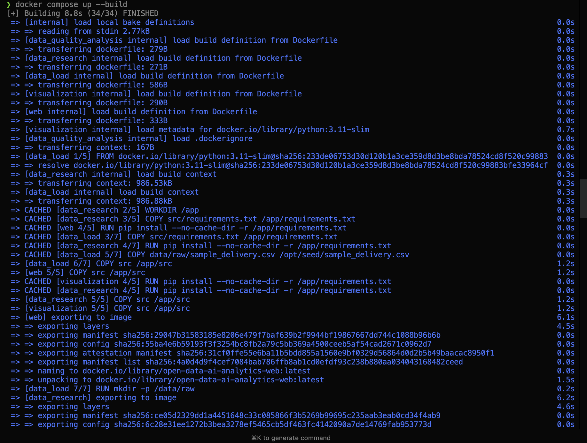
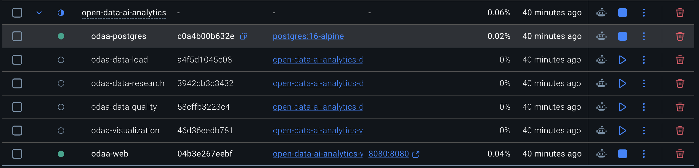
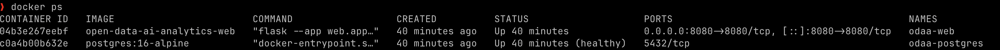
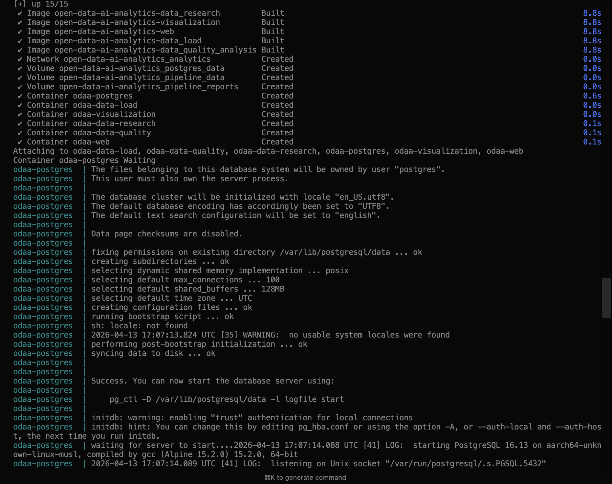
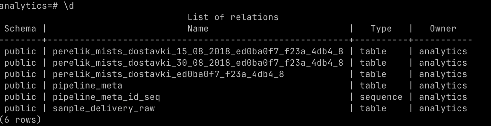
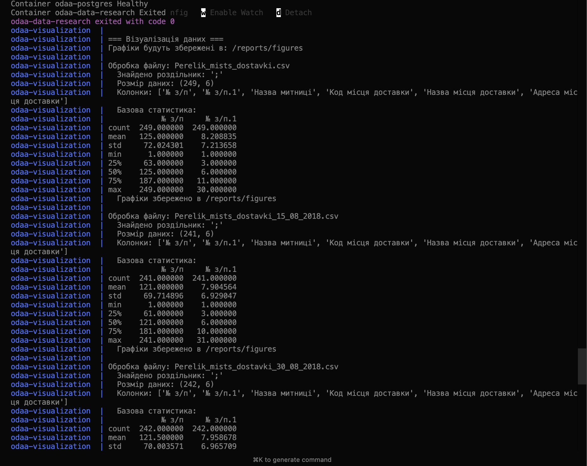
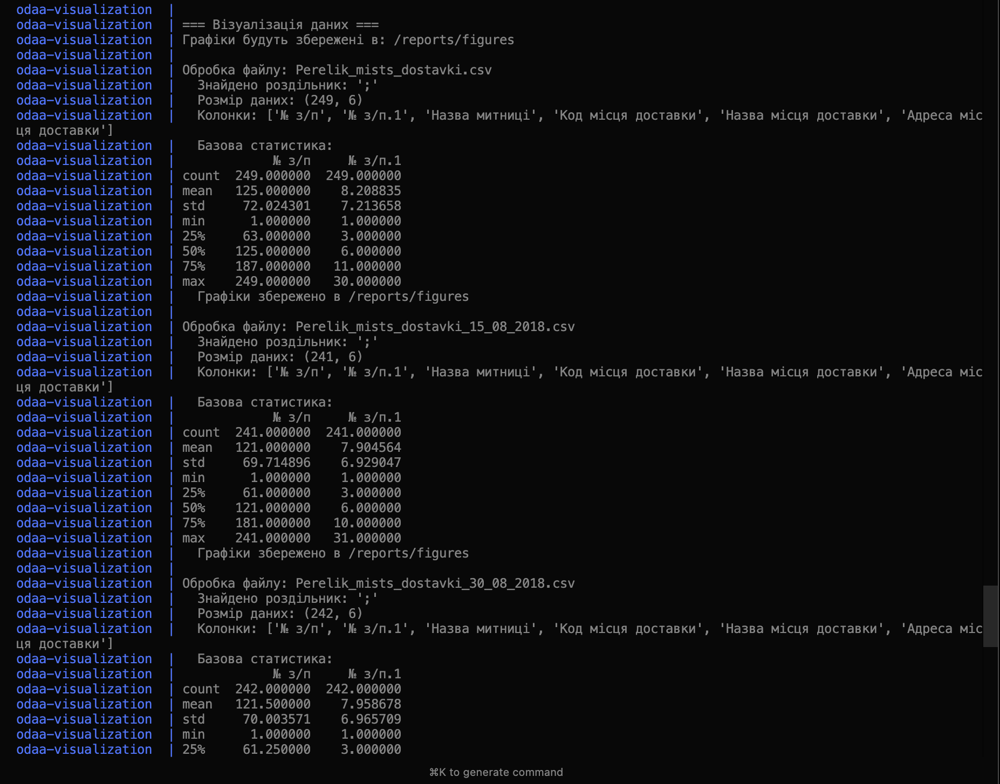
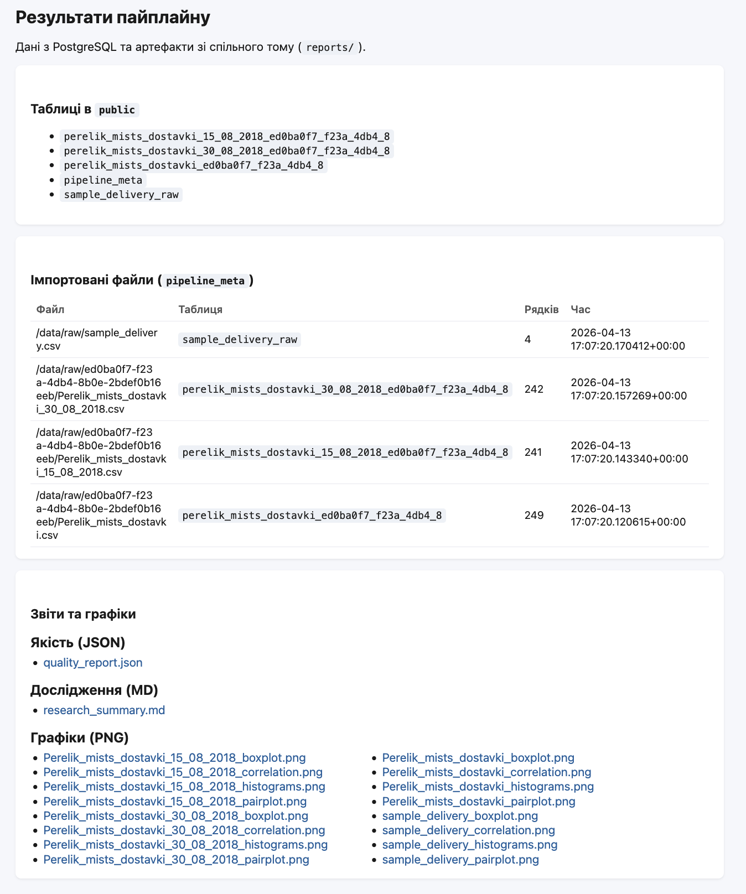
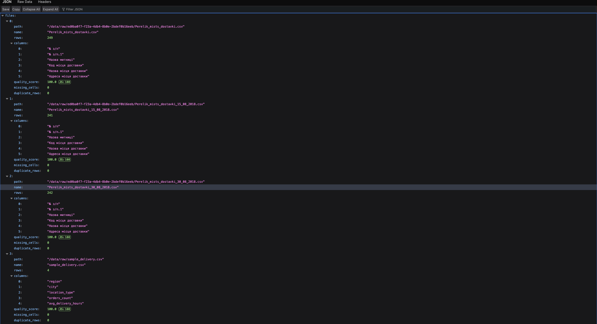
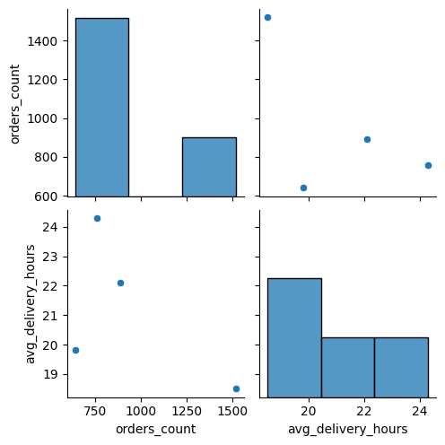

# Звіт: Лабораторна робота 3

[Репозиторій проєкту](https://github.com/Roman-BodnarSHI11/open-data-ai-analytics)

---

## Тема

Контейнеризація пайплайну аналізу відкритих даних за допомогою Docker та Docker Compose.

---

## Які сервіси створені

У файлі `compose.yaml` описано такі сервіси:

| Сервіс | Призначення |
|--------|-------------|
| **db** | PostgreSQL 16 (зберігання табличних даних і метаданих імпорту `pipeline_meta`). |
| **data_load** | Завантаження CSV (CKAN / демо-файл), імпорт у БД. Одноразовий контейнер (`restart: "no"`). |
| **data_quality_analysis** | Аналіз якості CSV, JSON-звіт у `/reports/quality/`. Одноразовий. |
| **data_research** | Зведення з вибірок PostgreSQL, Markdown у `/reports/research/`. Одноразовий. |
| **visualization** | Побудова графіків (PNG) у `/reports/figures/`. Одноразовий. |
| **web** | Веб-інтерфейс (Flask) на порту **8080** для перегляду таблиць БД і посилань на артефакти. Працює постійно (`restart: unless-stopped`). |

Окремо для кожного Python-сервісу зібрано власний **Dockerfile** у каталозі `docker/<ім’я_сервісу>/`.

---

## Як організовано взаємодію

- **Мережа:** усі контейнери підключені до користувацької мережі `analytics` (драйвер `bridge`), щоб сервіси звертались один до одного за DNS-іменами (`db`, `web` тощо).
- **Томи:**
  - `postgres_data` — персистентні файли PostgreSQL;
  - `pipeline_data` — спільний каталог сирих CSV (`/data/raw`) для завантаження та подальших модулів;
  - `pipeline_reports` — спільний каталог звітів і графіків (`/reports`), доступний аналітичним job-ам і веб-сервісу.
- **Потік даних:** `data_load` після готовності БД (`depends_on` + `service_healthy`) заповнює том і БД; **data_quality_analysis**, **data_research** і **visualization** стартують лише після **успішного** завершення `data_load` (`service_completed_successfully`); **web** чекає на готовність БД і завершення трьох аналітичних job-ів, після чого віддає UI в браузері.
- **Запуск:** одна команда з кореня репозиторію — `docker compose up --build`.

---

## Скріншоти (хронологія демонстрації)

Нижче — послідовність кроків перевірки стеку у Docker (від запуску до перегляду результатів).

### 1. Запуск `docker compose up --build`



### 2. Список контейнерів у Docker Desktop



### 3. Список контейнерів у CLI



### 4. Контейнери та PostgreSQL



### 5. Перегляд даних у базі



### 6. Результати візуалізації (1)



### 7. Результати візуалізації (2)




### 8. Веб-інтерфейс з результатами пайплайну



### 9. Якість JSON



### 10. Приклад візуалізації: парна діаграма (демо-дані)

Парний графік (**pairplot**) для демонстраційного файлу `sample_delivery.csv`: по діагоналі — розподіли числових показників, поза діагоналлю — залежності між колонками (наприклад, кількість замовлень і середній час доставки за регіонами). Такий тип візуалізації генерує сервіс `visualization`, коли у таблиці від двох до п’яти числових полів.



---

## Які труднощі виникли

1. **Дублікати назв колонок при імпорті в PostgreSQL.** Після санітизації лише латинських символів усі кириличні заголовки CSV перетворювались на однаковий ідентифікатор (`t_`), що спричиняло `sqlalchemy.exc.DuplicateColumnError` під час `pandas.DataFrame.to_sql`. **Вирішення:** введено генерацію базових імен `col_<індекс>` для «порожніх» після санітизації заголовків і окремий крок **унікалізації** імен колонок перед записом у БД (`src/data_load/db_import.py`), додано модульні тести.

2. **Попередження `RequestsDependencyWarning` (urllib3 / chardet).** З’являється при завантаженні з CKAN у контейнері; на коректність імпорту не вплинуло. За потреби можна вирівняти версії залежностей у `src/requirements.txt`.

3. **Перевірка стеку без Docker у середовищі розробки.** Локально не всі середовища мають встановлений Docker CLI — фінальну перевірку `docker compose up --build` виконувалось на власній машині користувача.

---

## Вивід команди `git log --oneline --graph --all`

```
* 33e104d (HEAD -> main, origin/main) docs: enhance Lab 3 report with additional visualizations an
d quality analysis; add new images for JSON quality and pairplot demonstration
* 0256b99 chore: update .gitignore to include sample_delivery.csv and enhance README with Docker a
rchitecture details; refactor constants for environment variable support; update requirements for 
Flask, SQLAlchemy, and psycopg2-binary
| * 855affe (origin/docker-init, docker-init) chore: update .gitignore to include sample_delivery.
csv and enhance README with Docker architecture details; refactor constants for environment variab
le support; update requirements for Flask, SQLAlchemy, and psycopg2-binary
|/  
```