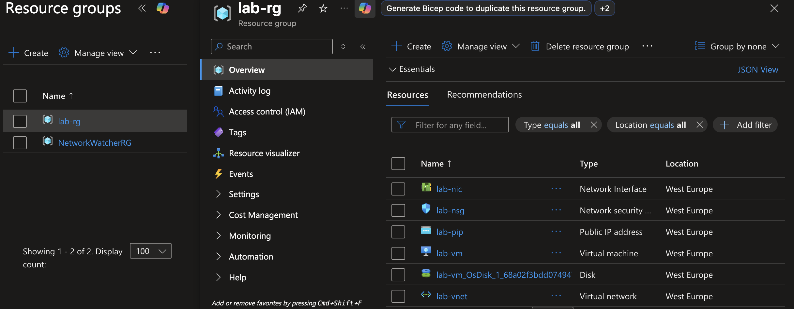
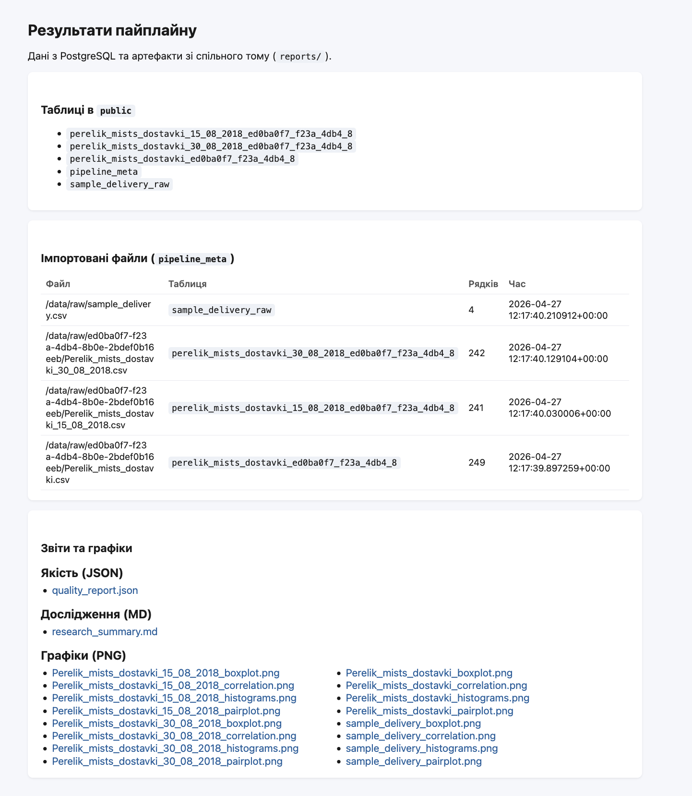

# Звіт: Лабораторна робота 4

[Репозиторій проєкту](https://github.com/Roman-BodnarSHI11/open-data-ai-analytics)

---

## Тема

Розгортання в Azure через Terraform

---

## 1) Які ресурси створює Terraform

За скріншотами `terraform plan` і `terraform apply` створюється **9 ресурсів** (`9 added, 0 changed, 0 destroyed`).  
Із `main.tf` та Azure Portal (`rg_lab.png`) видно, що розгортаються:

- `azurerm_resource_group` (`lab-rg`)
- `azurerm_virtual_network` (`lab-vnet`)
- `azurerm_subnet` (`lab-subnet`)
- `azurerm_public_ip` (`lab-pip`, static, Standard)
- `azurerm_network_security_group` (`lab-nsg`, відкриті порти 22 і 8080)
- `azurerm_network_interface` (`lab-nic`)
- `azurerm_network_interface_security_group_association` (прив'язка NIC до NSG)
- `azurerm_linux_virtual_machine` (`lab-vm`, Ubuntu 22.04)
- `tls_private_key` (генерація SSH-ключа Terraform)

Після створення VM в Azure також видно керований диск (`lab-vm_OsDisk...`), що підтверджено в порталі.




Фрагмент коду з `infra/terraform/main.tf`:

```hcl
resource "azurerm_network_security_group" "nsg" {
  name                = "lab-nsg"
  location            = azurerm_resource_group.rg.location
  resource_group_name = azurerm_resource_group.rg.name

  security_rule {
    name                       = "SSH"
    destination_port_range     = "22"
    access                     = "Allow"
  }

  security_rule {
    name                       = "Web"
    destination_port_range     = "8080"
    access                     = "Allow"
  }
}
```

## 2) Що робить cloud-init

`cloud-init.yaml` автоматично виконує первинне налаштування VM:

- оновлює систему (`package_update`, `package_upgrade`);
- встановлює залежності та Docker (Engine + Compose plugin);
- вмикає і запускає сервіс Docker;
- клонує репозиторій у `/opt/open-data-ai-analytics`;
- запускає проєкт командою `docker compose up -d`.

Фрагмент коду з `infra/terraform/cloud-init.yaml`:

```yaml
runcmd:
  - apt-get install -y docker-ce docker-ce-cli containerd.io docker-buildx-plugin docker-compose-plugin
  - systemctl enable docker
  - systemctl start docker
  - git clone ${repo_url} /opt/open-data-ai-analytics
  - cd /opt/open-data-ai-analytics && docker compose up -d
```

## 3) Як запускається Docker-проєкт

Запуск відбувається автоматично під час `cloud-init`:

1. `git clone ${repo_url} /opt/open-data-ai-analytics`
2. `cd /opt/open-data-ai-analytics && docker compose up -d`

Тобто після `terraform apply` ручний запуск контейнерів не потрібен.

## 4) Як перевірена працездатність

Працездатність перевірена двома способами:

- через `curl http://20.16.129.135:8080` отримано HTML-відповідь застосунку (скрін `cloud-init done (http answer).png`);
- у браузері відкривається веб-інтерфейс за `http://20.16.129.135:8080` (скрін `web.png`) з таблицями, імпортованими файлами та звітами/графіками.

.png)


Фрагмент коду з `infra/terraform/outputs.tf`:

```hcl
output "web_url" {
  value       = "http://${azurerm_public_ip.pip.ip_address}:8080"
  description = "URL для доступу до веб-інтерфейсу"
}
```

## 5) Хронологія Terraform-команд у скріншотах

Послідовність виконання:

1. Перевірка файлів Terraform (`ls`).


2. Ініціалізація Terraform (`terraform init`).


3. Форматування і валідація (`terraform fmt`, `terraform validate`).


4. Перевірка плану змін (`terraform plan`).


5. Створення інфраструктури (`terraform apply`).


6. Верифікація ресурсів у Azure Portal (`lab-rg`).


7. Перевірка доступності застосунку після cloud-init (`curl http://PUBLIC_IP:8080`).
.png)

8. Фінальна перевірка UI в браузері (`web_url` з outputs).


9. Видалення інфраструктури після завершення роботи (`terraform destroy`).

