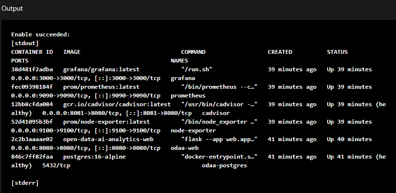
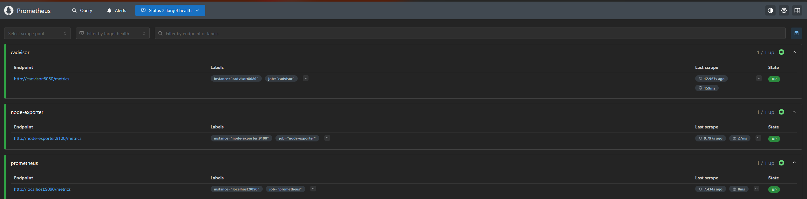
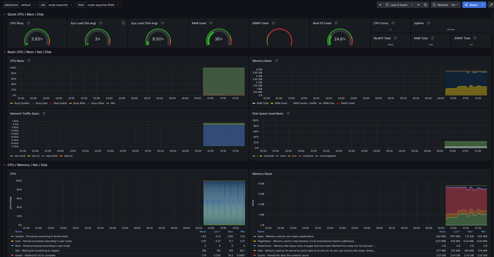
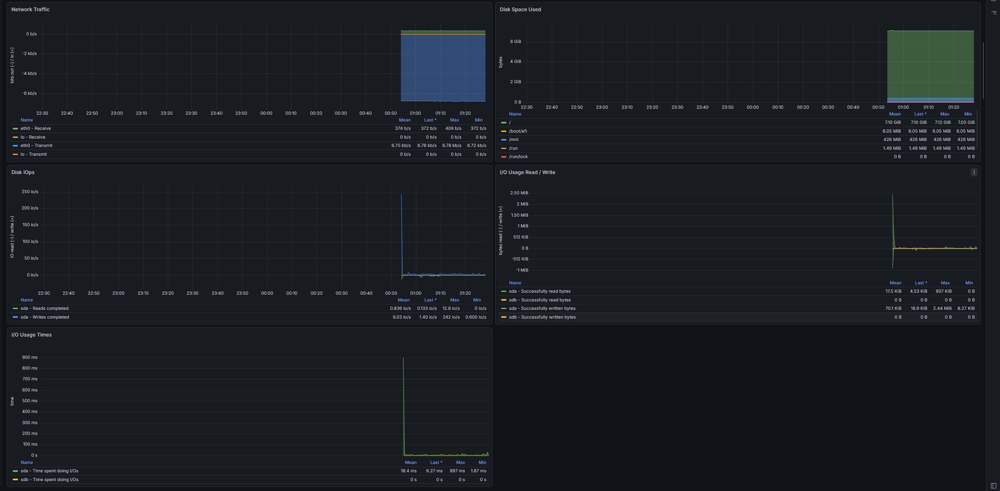
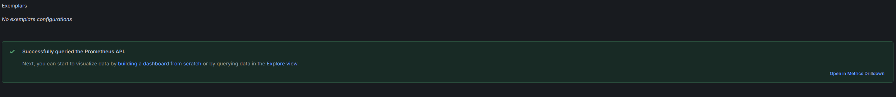
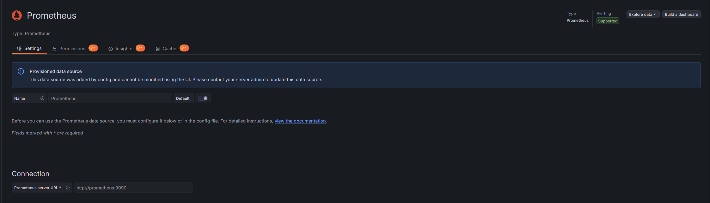
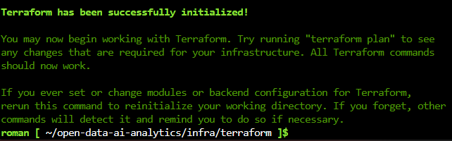
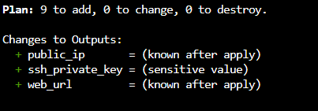
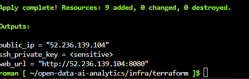

# Звіт: Лабораторна робота 5

[Репозиторій проєкту](https://github.com/Roman-BodnarSHI11/open-data-ai-analytics)

---

## Тема

Моніторинг контейнерів і хоста: Prometheus, Grafana, Node Exporter і cAdvisor

---

## 1) Які сервіси входять у стек моніторингу

У файлі `monitoring/docker-compose.monitoring.yml` описано окремий Compose-проєкт у користувацькій мережі `monitoring`:

| Сервіс | Образ / роль | Порт на хості |
|--------|----------------|---------------|
| **prometheus** | `prom/prometheus` — збір і зберігання часових рядів | **9090** |
| **grafana** | `grafana/grafana` — візуалізація та дашборди | **3000** |
| **node-exporter** | `prom/node-exporter` — метрики ОС (CPU, пам’ять, диск тощо) | **9100** |
| **cadvisor** | `gcr.io/cadvisor/cadvisor` — метрики Docker-контейнерів | **8081** (внутрішній 8080 контейнера; зовнішній порт змінено, щоб не конфліктувати з веб-застосунком на 8080) |

Томи `prometheus_data` і `grafana_data` забезпечують збереження TSDB Grafana між перезапусками.

Фрагмент з `monitoring/docker-compose.monitoring.yml`:

```yaml
services:
  prometheus:
    image: prom/prometheus:latest
    ports:
      - "9090:9090"
    volumes:
      - ./prometheus/prometheus.yml:/etc/prometheus/prometheus.yml
      - prometheus_data:/prometheus

  grafana:
    image: grafana/grafana:latest
    ports:
      - "3000:3000"
    volumes:
      - grafana_data:/var/lib/grafana
      - ./grafana/provisioning:/etc/grafana/provisioning

  node-exporter:
    image: prom/node-exporter:latest
    ports:
      - "9100:9100"

  cadvisor:
    image: gcr.io/cadvisor/cadvisor:latest
    ports:
      - "8081:8080"
```

У Terraform для NSG додано правила вхідного трафіку на порти веб-інтерфейсу (**8080**), Grafana (**3000**) та Prometheus (**9090**), щоб можна було перевіряти сервіси ззовні після `terraform apply`.

---

## 2) Як налаштований Prometheus

Файл `monitoring/prometheus/prometheus.yml` задає інтервал опитування **15 с** і три job-и `scrape`:

- **prometheus** — self-monitoring екземпляра Prometheus (`localhost:9090` всередині контейнера);
- **node-exporter** — ціль `node-exporter:9100` у Docker-мережі;
- **cadvisor** — ціль `cadvisor:8080` (внутрішній порт cAdvisor).

Фрагмент коду:

```yaml
global:
  scrape_interval: 15s

scrape_configs:
  - job_name: 'prometheus'
    static_configs:
      - targets: ['localhost:9090']

  - job_name: 'node-exporter'
    static_configs:
      - targets: ['node-exporter:9100']

  - job_name: 'cadvisor'
    static_configs:
      - targets: ['cadvisor:8080']
```

---

## 3) Як підключено Grafana до Prometheus

Через provisioning у `monitoring/grafana/provisioning/datasources/datasources.yml` datasource **Prometheus** створюється автоматично з URL `http://prometheus:9090` (DNS-ім’я сервісу в тій самій мережі Compose), тип `prometheus`, режим доступу `proxy`, позначено як джерело за замовчуванням.

```yaml
datasources:
  - name: Prometheus
    type: prometheus
    access: proxy
    url: http://prometheus:9090
    isDefault: true
```

Початковий пароль адміністратора Grafana задається змінною оточення `GF_SECURITY_ADMIN_PASSWORD` у Compose (для лабораторної роботи — зручне значення для першого входу; у продакшені його слід змінити).

---

## 4) Як перевірена працездатність

- **Контейнери:** підняті сервіси `prometheus`, `grafana`, `node-exporter`, `cadvisor` видно у списку запущених контейнерів (скрін `containers_prometheus_grafana.png`).
- **Prometheus → Status → Targets:** усі конфігуровані job-и в стані **UP** (скрін `prometheus_targets.png`).
- **Node Exporter:** через браузер перевірено доступність метрик на порту **9100** (скріни `Node_Exporter.png`, `Node_Exporter_2.png`).
- **cAdvisor:** перевірено UI експортера контейнерних метрик (скрін `cAdvisor_exporter .png`).
- **Grafana:** у налаштуваннях datasource виконано **Save & test** — підключення до Prometheus успішне (скрін `grafana_prometheus_test_success.png`), у Explore доступні метрики Prometheus (скрін `prometheus_in_grafana.png`).














---

## 5) Хронологія Terraform і перевірок у скріншотах

Послідовність роботи з інфраструктурою та моніторингом:

1. Ініціалізація Terraform у каталозі `infra/terraform` (`terraform init`).


2. Перегляд плану змін (`terraform plan`) — зокрема оновлення NSG для портів Grafana та Prometheus.


3. Застосування змін (`terraform apply`).


4. Запуск моніторингового стеку та перевірка контейнерів (`docker compose` у каталозі `monitoring`).


5. Перевірка цілей у Prometheus (**Targets** — усі UP).


6. Перегляд метрик Node Exporter у браузері.


7. Перегляд інтерфейсу cAdvisor.


8. У Grafana — успішний тест datasource Prometheus та робота з метриками в Explore.


---

## 6) Які труднощі виникли

Найменший за масштабом, але блокувальний випадок стосувався **неправильної конфігурації моніторингу**: помилки в файлах, які монтуються в контейнери або задають мережеві залежності (наприклад, некоректний `prometheus.yml`, шлях до конфігурації, синтаксис YAML, невідповідність імен сервісів цілям у `scrape_configs`, або неконсистентне provisioning Grafana). Через це **`docker compose`** з `monitoring/docker-compose.monitoring.yml` **не міг стабільно розгорнути стек**: один або кілька сервісів падали при старті або одразу перезапускалися, поки конфігурація не була виправлена та узгоджена з реальними іменами контейнерів і портами у Docker-мережі.

---

## 7) Які спостереження зроблено за результатами моніторингу

- **Цілі та збір:** усі налаштовані job-и в Prometheus були в стані **UP** — отже, інтервал **15 с** достатній для стабільного опитування Node Exporter і cAdvisor у межах лабораторного навантаження; збої збирача не спостерігалось на скріншоті `prometheus_targets.png`.

- **Хост (Node Exporter):** у текстовому виводі метрик видно класичні показники навантаження на ОЗП, CPU та мережу в форматі, зручному для запитів PromQL; це підтверджує, що експортер коректно читає `/proc` та інші змонтовані точки з хоста.

- **Контейнери (cAdvisor):** через UI cAdvisor видно окремі контейнери та їх споживання ресурсів — корисно порівнювати з процесами на хості й розуміти, яку частку дає сам Dockerized-навантаження (зокрема Prometheus і Grafana) порівняно з іншими сервісами.

- **Grafana:** після успішного **Save & test** для Prometheus у Explore можна будувати запити до тих самих метрик, що збирає Prometheus; це зводить разом «сирий» вигляд у `/metrics` та зручний аналіз у BI-інтерфейсі.

Загалом моніторинг показав узгоджену картину: метрики хоста й контейнерів доступні в одному TSDB, а Grafana підтверджує можливість подальшої візуалізації та алертингу без зміни архітектури збору.

---

## Висновок

Розгорнуто класичний стек спостереження: **Prometheus** збирає метрики з самого себе, **Node Exporter** і **cAdvisor**; **Grafana** отримує дані з Prometheus через provisioned datasource. Інфраструктура в Azure оновлена правилами NSG для доступу до портів веб-UI та моніторингових інтерфейсів; працездатність підтверджена скріншотами контейнерів, сторінки Targets у Prometheus, UI експортерів і тестом підключення в Grafana.


## Вивід команди `git log --oneline --graph --all`

```
* 1c800cd (HEAD -> main, origin/main, origin/HEAD) docs: add Lab 5 report detailing monitoring stack setup with Prometheus, Grafana, Node Exporter, and cAdvisor; include configuration examples and verification screenshots
* 88e9503 feat: refine Azure network security group configuration by adding outbound rules for Grafana
* 8216e26 feat: enhance Azure network security group configuration with inbound rules for Grafana
* 5c2357e feat: add inbound security rule for Grafana in Azure network security group configuration
* df6f5aa Fix comment for port 8081 mapping
* 76f6549 chore: add initial monitoring configuration files for Docker, Grafana, and Prometheus
| * fc99d73 (origin/monitoring, monitoring) chore: add initial monitoring configuration files for Docker, Grafana, and Prometheus
|/
```