# Звіт: Лабораторна робота 6

[Репозиторій проєкту](https://github.com/Roman-BodnarSHI11/open-data-ai-analytics)

---

## Тема

GitOps-розгортання застосунку в Kubernetes (k3s) за допомогою Argo CD.

---

## Мета роботи

Налаштувати та продемонструвати практичний GitOps-процес для Kubernetes-застосунку: розгортання через Argo CD, автоматичну синхронізацію змін із Git-репозиторію, перевірку оновлення після коміту та відновлення попереднього стану через rollback.

---

## 1) Які ресурси та компоненти використано для GitOps

У цій лабораторній використано зв'язку:

- **Azure VM + Terraform** (`infra/terraform`) для базової інфраструктури і мережевого доступу;
- **k3s** (встановлюється через `cloud-init`) як Kubernetes-кластер на VM;
- **Argo CD** для безперервної синхронізації стану кластера з Git-репозиторієм;
- **Kubernetes маніфести застосунку** в `gitops/app` (`Namespace`, `ConfigMap`, `Deployment`, `Service`, `Application`).

У `infra/terraform/main.tf` додано правила NSG для доступу до:

- `30080` — NodePort застосунку;
- `30443` — UI Argo CD;
- а також раніше налаштованих сервісів (`8080`, `3000`, `9090`, `22`).

`infra/terraform/outputs.tf` повертає:

- `argocd_url` (`http://PUBLIC_IP:30443`);
- `app_url` (`http://PUBLIC_IP:30080`).

---

## 2) Як налаштовано Argo CD Application

Файл `gitops/app/argocd/application.yaml` описує Argo CD Application:

- `repoURL`: GitHub-репозиторій проєкту;
- `targetRevision`: `main`;
- `path`: `gitops/app`;
- `destination.namespace`: `openapp`;
- `syncPolicy.automated.prune: true` і `selfHeal: true`;
- `CreateNamespace=true` для автоматичного створення namespace під час sync.

Це означає, що при зміні маніфестів у Git Argo CD автоматично підтягує нову версію в кластер, а при дрейфі стану — самовідновлює ресурси до desired state.

---

## 3) Як описано застосунок у Kubernetes

Маніфести в `gitops/app` реалізують мінімальний демо-застосунок:

- `namespace.yaml` — namespace `openapp`;
- `configmap.yaml` — HTML-сторінка застосунку (текст версії);
- `deployment.yaml` — `2` репліки `nginx:alpine`, монтування `index.html` з ConfigMap, readiness probe;
- `service.yaml` — Service `NodePort` на порту `30080`.

Оновлення контенту в `ConfigMap` + коміт у Git → автоматична синхронізація Argo CD → застосунок оновлюється без ручного `kubectl apply`.

---

## 4) Як перевірена працездатність GitOps-процесу

Працездатність перевірено через:

- статус Argo CD (`Synced`, `Healthy`) і граф ресурсів застосунку;
- відкриття застосунку через NodePort;
- демонстрацію автоматичного оновлення після коміту в Git;
- демонстрацію rollback через revert-коміт;
- перевірку стану подів через `kubectl`.

Скріншоти нижче показують повний цикл: від розгортання Argo CD до автосинхронізації й повернення попередньої версії.

---

## 5) Хронологія виконання (скріншоти)

1. `terraform apply` для оновлення/створення інфраструктури і мережевих правил.
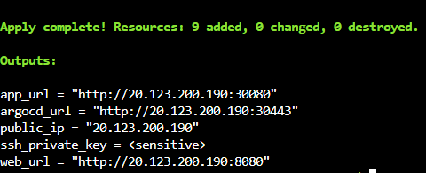

2. Створення namespace `argocd`.
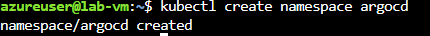

3. Перевірка, що pod-и Argo CD запущені.
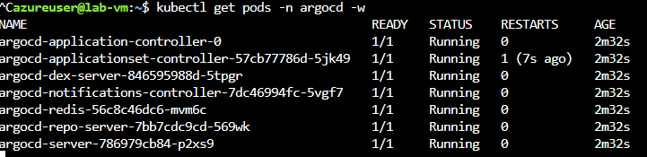

4. Експонування `argocd-server` як NodePort для доступу до UI.
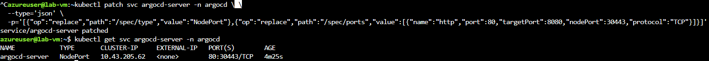

5. Отримання початкового пароля адміністратора Argo CD.
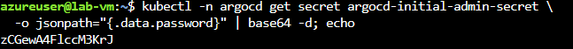

6. Вхід у веб-інтерфейс Argo CD.
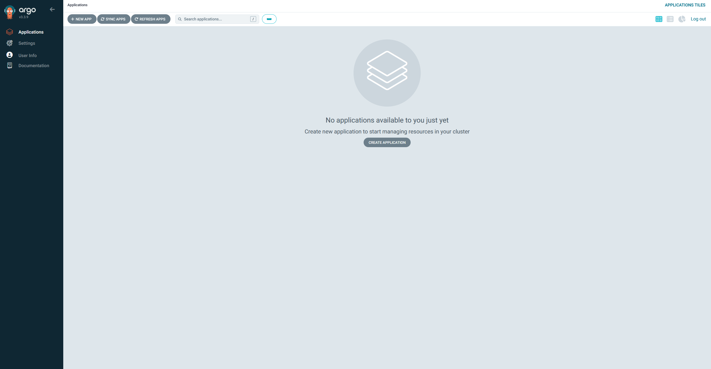

7. Створення Application `openapp` з репозиторію.
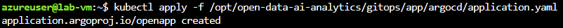

8. Перевірка статусу застосунку в Argo CD.
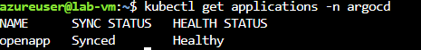

9. Перегляд графа ресурсів (namespace, deployment, replicasets, pods, service, configmap).
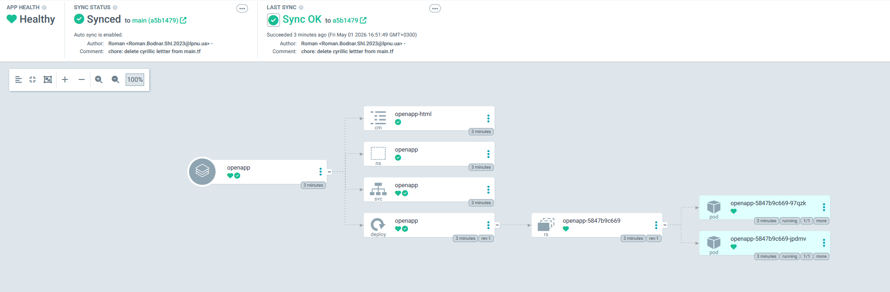

10. Відкриття застосунку з Argo CD (open app).
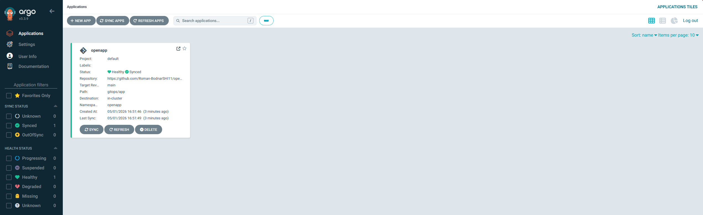

11. Перевірка namespace `openapp` у кластері.
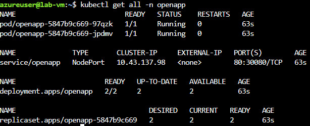

12. Перевірка стартової версії застосунку (`v1`).
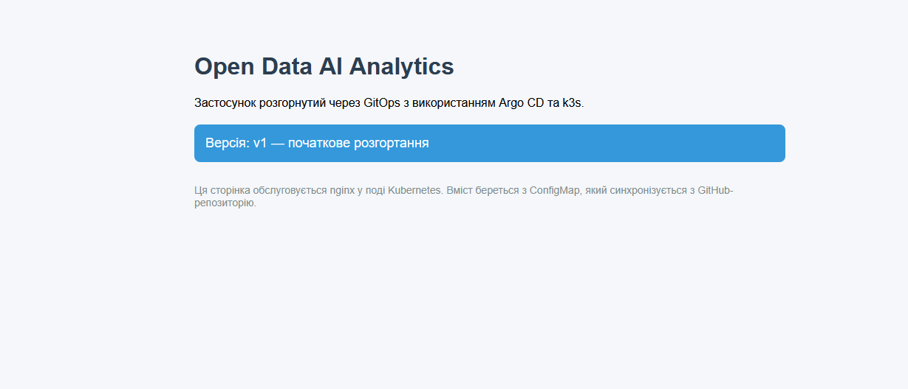

13. Коміт із зміною маніфесту (оновлення застосунку).


14. Argo CD фіксує різницю (`OutOfSync`) і запускає синхронізацію.


15. Автоматично оновлений застосунок після sync.
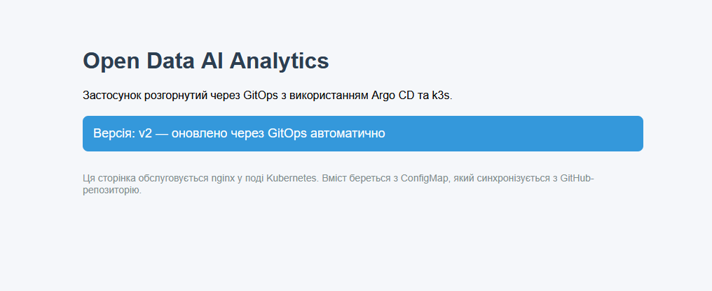

16. Revert-коміт у Git для повернення попереднього стану.
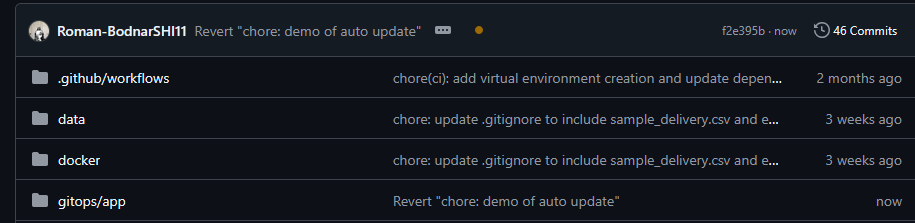

17. Після синхронізації Argo CD знову показує стабільний стан.
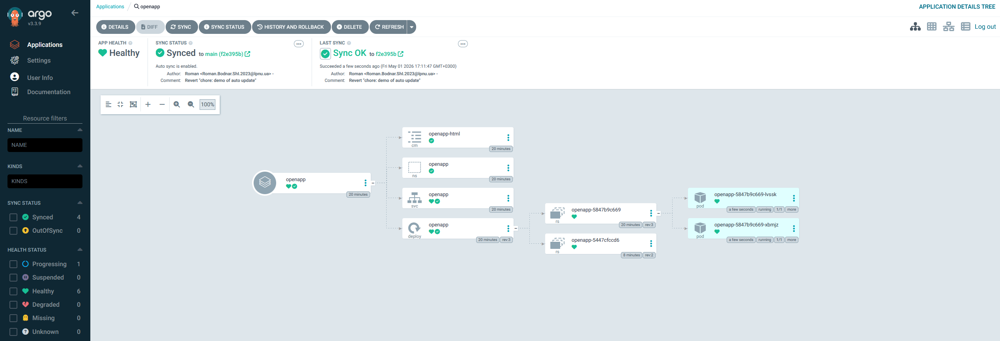

18. Застосунок підтверджує rollback (повернення попереднього контенту/версії).
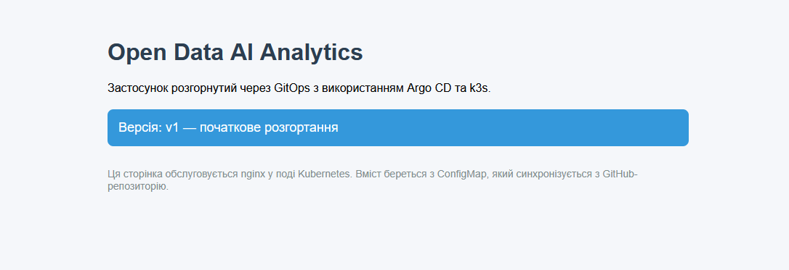

19. Додаткова перевірка моніторингу: Grafana у середовищі.
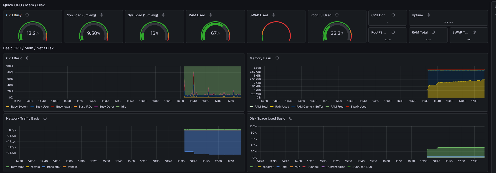

20. Додаткова перевірка метрик контейнерів через cAdvisor.
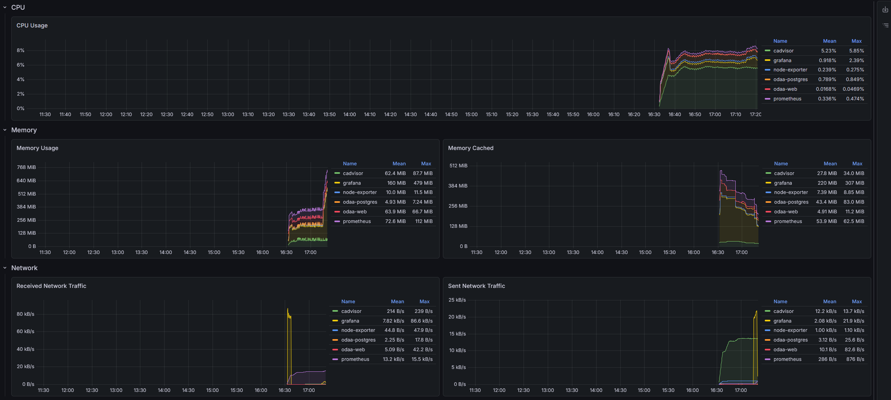

21. Фінальна перевірка стану ресурсів через `kubectl` (зокрема `kubectl get nodes` і перевірка об'єктів застосунку).
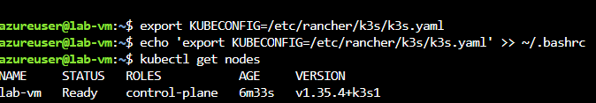

---

## 6) Які труднощі виникли

1. **Доступ до Argo CD UI ззовні.**  
   За замовчуванням сервіс `argocd-server` у кластері не завжди зручний для зовнішнього доступу, тому його довелось перевести в `NodePort` і відкрити порт `30443` у NSG.

2. **Синхронізація через GitOps вимагає дисципліни комітів.**  
   Будь-яка зміна в `main` одразу стає desired state для кластера, тому для демонстрації rollback важливо робити окремі атомарні коміти і revert.

3. **Перевірка стану після змін.**  
   Потрібно контролювати і Argo CD UI (Synced/Healthy), і фактичний стан у кластері (`kubectl`) — лише разом це дає повну картину.

---

## 7) Висновок

У лабораторній продемонстровано повний цикл GitOps:

- інфраструктура підготовлена Terraform;
- k3s і Argo CD розгорнуті на VM;
- застосунок описано декларативними YAML-маніфестами;
- Argo CD автоматично синхронізує зміни з Git та виконує self-heal/rollback через історію комітів.

Підхід підтвердив, що керування релізами через Git забезпечує відтворюваність, прозорість змін і швидке повернення до стабільної версії.

---

## Вивід команди `git log --oneline --graph --all`

```text
* f2e395b Revert "chore: demo of auto update"
* 41dc9d0 chore: demo of auto update
* a5b1479 chore: delete cyrillic lettter from main.tf
* e4db05e chore: further optimize Kubernetes deployment configuration by refining resource limits and enhancing performance settings
* 686fd17 chore: update Kubernetes deployment configuration to improve resource allocation and streamline application performance
* bd35414 chore: enhance Kubernetes configuration by adding new resource limits and optimizing deployment settings
* 6aa019e chore: update Kubernetes configuration files to include additional resource definitions and improve deployment strategies
* ea3a955 chore: add initial Kubernetes configuration files including ConfigMap, Deployment, Namespace, Service, and ArgoCD application
| * 2618001 chore: add initial Kubernetes configuration files including ConfigMap, Deployment, Namespace, Service, and ArgoCD application
|/
* 826203d docs: add git log output to Lab 5 report for better tracking of commit history and changes made
* 1c800cd docs: add Lab 5 report detailing monitoring stack setup with Prometheus, Grafana, Node Exporter, and cAdvisor; include configuration examples and verification screenshots
* 88e9503 feat: refine Azure network security group configuration by adding outbound rules for Grafana
* 8216e26 feat: enhance Azure network security group configuration with inbound rules for Grafana
* 5c2357e feat: add inbound security rule for Grafana in Azure network security group configuration
* df6f5aa Fix comment for port 8081 mapping
* 76f6549 chore: add initial monitoring configuration files for Docker, Grafana, and Prometheus
| * fc99d73 chore: add initial monitoring configuration files for Docker, Grafana, and Prometheus
|/
* ab3502f Update README with outputs for application access
* 694b910 feat: implement Azure infrastructure deployment with Terraform, including VM setup and Docker configuration via cloud-init; add outputs for public IP and web URL; enhance README with setup instructions and project structure
* 580abb3 docs: update Lab 3 report to include git log
* 33e104d docs: enhance Lab 3 report with additional visualizations and quality analysis; add new images for JSON quality and pairplot demonstration
* 0256b99 chore: update .gitignore to include sample_delivery.csv and enhance README with Docker architecture details; refactor constants for environment variable support; update requirements for Flask, SQLAlchemy, and psycopg2-binary
| * 855affe chore: update .gitignore to include sample_delivery.csv and enhance README with Docker architecture details; refactor constants for environment variable support; update requirements for Flask, SQLAlchemy, and psycopg2-binary
|/
* 0c55998 docs: update pytest step in run-modules job
* 913e569 docs: add report for Lab 2 on CI/CD pipeline implementation using GitHub Actions
* 3a13e58 chore(ci): add virtual environment creation and update dependency installation commands in CI workflow
* 9148a66 chore(ci): enhance Python verification and streamline dependency installation in CI workflow
* ebfc1e5 chore(ci): refactor virtual environment setup and streamline dependency installation in CI workflow
* 0d17b1a chore(ci): update Python setup and dependency installation in CI workflow
* af7efd4 chore(ci): update self-hosted runner configuration to support macOS and ARM64
* 6f2ff64 chore: set up pytest configuration and add initial test files for data loading, quality analysis, and visualization
* 48040e1 chore(ci): remove pyproject.toml from CI workflow paths and add requirements.txt
* 72dc621 feat(ci): enhance module resolution and execution in CI workflows
* 9b46c51 fix(ci): improve conditional logic for module execution in CI workflow
* e20b534 fix(ci): delete path matching
* 83b4249 chore: update .gitignore to include .DS_Store
* fed8f73 ci: self-host runner
* bb65eef ci: cloud runner
* 34d32b9 refactor: project structure
| * c6c20e6 chore: set up pytest configuration and add initial test files for data loading, quality analysis, and visualization
| * 5c0f0d6 chore(ci): remove pyproject.toml from CI workflow paths and add requirements.txt
| * 2b107e9 feat(ci): enhance module resolution and execution in CI workflows
| * 4b13143 fix(ci): improve conditional logic for module execution in CI workflow
| * 126fbd7 fix(ci): delete path matching
| * e8034d7 chore: update .gitignore to include .DS_Store
| * ee1bd49 ci: self-host runner
| * dcd3fde ci: cloud runner
| * 4d9339c refactor: project structure
|/
* 4abae9c docs: add changelog and report for lab_1
* 667e46f Update title in README.md
* f96800f feat: add data visualization
| * dda103f feat: add data visualization
|/
* 10f5637 docs: change readme file
| * a319005 docs: change readme file
|/
* d9de624 docs: change readme (#4)
| * 64c592c docs: change readme
|/
* 4dcfeff feat: add data and model analysis (#3)
* 98bb0c9 feat: add exploratory data analysis (#2)
| * 4457602 feat: add data and model analysis
|/
| * e1608fe feat: add exploratory data analysis
|/
*   c0d6b46 Merge pull request #1 from Roman-BodnarSHI11/feature/data_load
|\
| * a588cbc add script to load data
|/
* 038e599 initial commit
```
